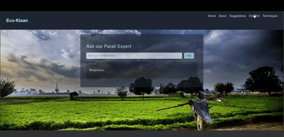
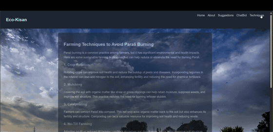

# Eco-Kisan

A web platform aimed at farmers in the stubble burning belt, built by
**Team Quasar** over a weekend in October 2024.

The problem it targets is *parali* burning. Farmers clear crop residue by
burning it because burning is fast, cheap and requires nothing they do not
already have. The smoke drives the air quality collapse in North India every
October and November, and it starts forest fires.

The argument the project makes is that enforcement alone does not work on a
practice this rational for the person doing it. What changes behaviour is
knowing the alternatives exist, and being able to reach them.

---

## Status, stated up front

**This is a 48 hour hackathon prototype and the AI features are not implemented.**
It is published as it was written.

The pitch video describes drone surveillance, a live pollution index, multilingual
voice support, government scheme access and live market rates. What exists in this
repository is the front end, with those parts stubbed.

The team was honest about that in the code itself. The chatbot component is named
`FakeChatbot`. It does a single substring match on one phrase about reducing
parali burning, returns one hardcoded paragraph, and otherwise says it cannot
help. Nobody dressed it up as a model.

`three`, `@react-three/fiber` and `@react-google-maps/api` are all in
`package.json` and **none of them are imported anywhere in `src/`**. The 3D drone
model ships in `public/models/drone.obj` at 2.4 MB and is never loaded. Those were
the next thing, and the weekend ran out.

That gap is the interesting part of this repo, not something to hide. A README
claiming a working drone pipeline would be worth less than one that says which
48 hours of work actually happened.

---

## What works



Five routes under `react-router-dom`, animated throughout with `framer-motion`:

| Route | Page |
|---|---|
| `/` | Hero and a news feed |
| `/about` | The drone surveillance concept |
| `/suggestions` | Public suggestion form with a seeded list |
| `/chatbot` | Ask our Parali Expert |
| `/farming-techniques` | Alternatives to burning |

**The news feed** carries three real items from October 2024: over 400 recorded
stubble burning incidents across Punjab and Haryana and the effect on Delhi's air,
the Supreme Court criticising both state governments over enforcement, and the
Commission for Air Quality Management deploying monitoring teams to hotspots.



**The techniques page** is the part that actually addresses the problem. Crop
rotation with legumes to fix nitrogen and cut fertiliser need, mulching the
residue in place to hold moisture and suppress weeds, and composting. Each one
removes the reason to burn rather than penalising the burn.

**The suggestions page** collects public input into local state, seeded with two
entries so the page is not empty on first load.

---

## Running it

```bash
npm install
```

```bash
npm start
```

Create React App, so it serves on `http://localhost:3000`.

---

## Repository history, and where the source went

For over a year the `main` branch of this repository contained a single file, a
README with the project name and nothing else. The source looked lost.

It was not. On a second branch called `real`, someone had committed an **entire
`.git` directory as plain files**: `HEAD`, `config`, `index`, `logs` and around
forty loose objects. Git will happily track another repository's internals as
ordinary content if they are added that way, and the working tree never gets
pushed, only its database.

Rebuilding a `.git` directory from those files and checking it out restored the
whole project.

The original commit is preserved here rather than replaced with a fresh one, so
the date and author are real: **27 October 2024, by Aditya Naidu**.

`.gitignore` now excludes `**/.git/` so this cannot happen again.

---

## Team

**Team Quasar**

Aditya Bhaty · Aditya Naidu · Nehal Mishra · Ananya Jain · Chirag Pithadia ·
Nishita Dubey

The same team that built [PACE HUB](https://github.com/Adi-ctive/PACE) for the
NASA Space Apps Challenge three weeks earlier. Individual task splits were not
recorded at the time and are not guessed at here.

---

## Links

| | |
|---|---|
| Demo video | https://www.youtube.com/watch?v=kBAwqGT-3Yk |

The two clips above are the only footage of the application itself. The rest of
the demo video is stock material and screen recordings of public documents, and
belongs to its respective owners.
